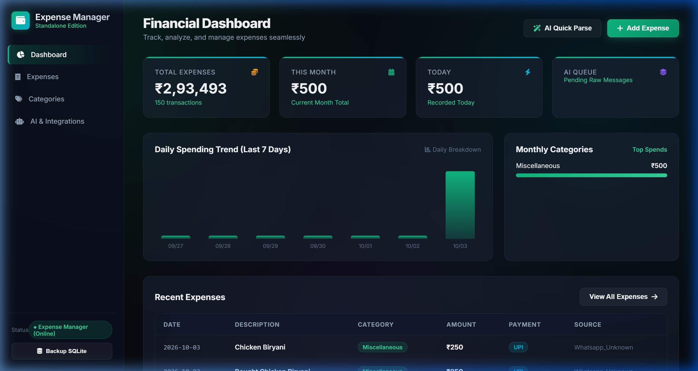
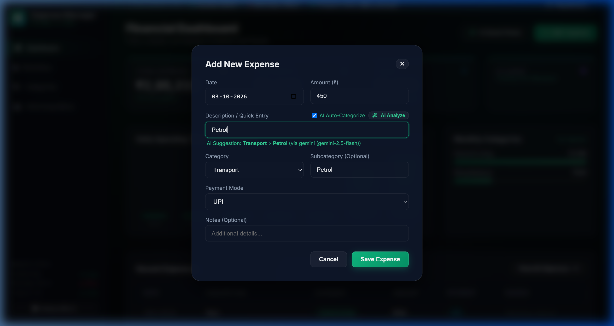
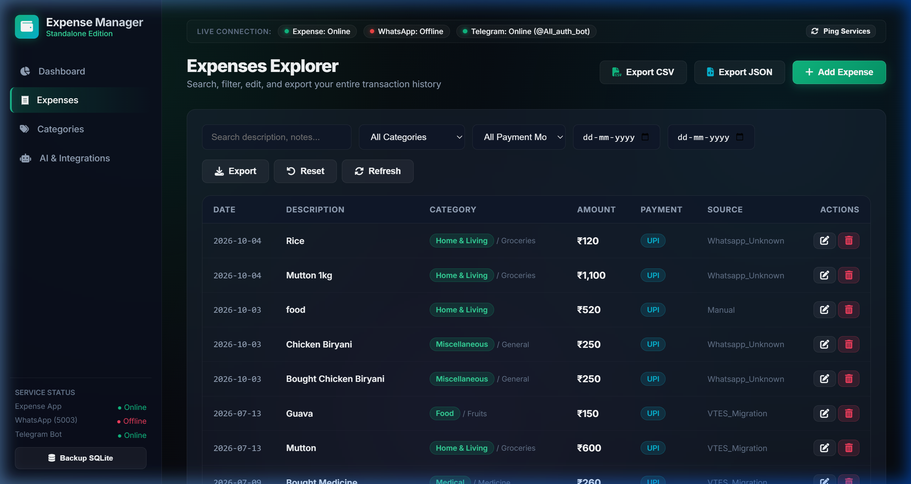
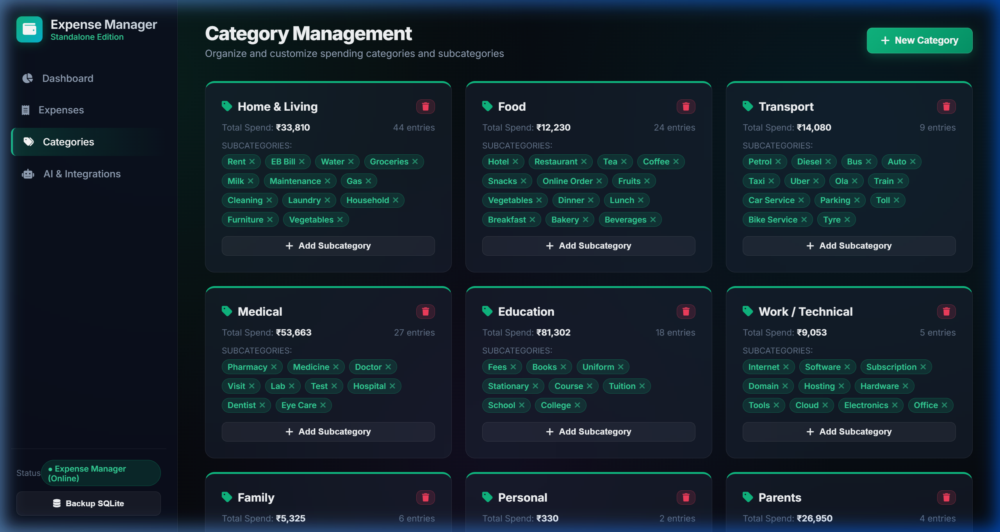
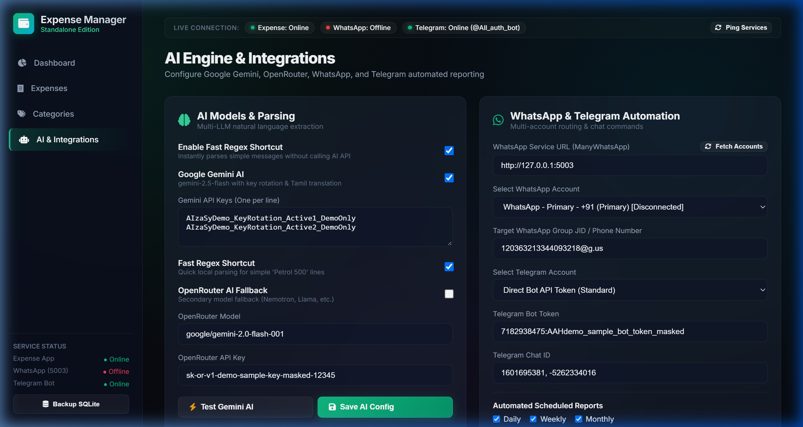

<div align="center">


# 💎 Expense Manager

### *Next-Gen Glassmorphic Personal Finance & AI Expense Tracking System*

[](https://python.org)
[](https://flask.palletsprojects.com/)
[](https://sqlite.org)
[](https://ai.google.dev/)
[](https://whatsapp.com)
[](https://telegram.org)
[](LICENSE)

<br/>

**Expense Manager** is an autonomous personal and business expense tracking application featuring an **emerald-and-cyan glassmorphism UI/UX**, deep **Google Gemini AI** natural language parsing, and integrations with **WhatsApp** and **Telegram**.

[Features](#-key-features) • [Screenshots](#-screenshots--walkthrough) • [Quick Start](#-quick-start) • [Chat Commands](#-chat-commands-whatsapp--telegram) • [Project Structure](#-project-structure) • [GitHub Repo Suggestions](#-recommended-github-repository-names)

</div>

---

## 🌟 Key Features

- 💎 **Glass Financial Dashboard**: Real-time spending metrics, all-time totals, monthly totals, today's transactions, 7-day spending trend chart, and live category budget breakdown.
- ⚡ **Live Tri-Service Status Monitor**: Visual glowing indicators monitoring Expense Database, WhatsApp ManyWhatsApp gateway (port 5003), and Telegram Bot API.
- 🤖 **Google Gemini 2.5 AI Engine**:
  - High-precision transaction extraction with structured JSON generation.
  - Multi-key rotation with automatic failover and dead-key filtering.
  - Tamil and Tanglish natural phrase translation to English (*"kaikari"* ➔ *"Vegetables"*, *"paal"* ➔ *"Milk"*).
  - OpenRouter API fallback support (Nemotron, Llama 3.3, DeepSeek) and local LLM endpoints.
- ✨ **AI Auto-Fill for Manual Entries**: Type `Petrol 450` or `Chicken biryani 250` in the *Add Expense* form and click **AI Analyze** to auto-populate Category, Subcategory, Amount, Payment Mode, and clean Description.
- 📊 **Expenses Explorer & One-Click Export**: Search, filter by Category, Payment Mode, Date range (From / To), paginate transactions, and export filtered results to **CSV** or **JSON**.
- 🏷️ **Dynamic Category & Subcategory Management**: Create custom categories, select color codes and FontAwesome icons, add subcategories, and delete categories or individual subcategory tags.
- 💬 **WhatsApp & Telegram Chat Automation**:
  - Multi-account selection routing WhatsApp and Telegram chat notifications.
  - Webhook listener (`POST /api/webhook/message`) logging expenses directly from incoming chat messages with duplicate prevention.
  - Automated Daily, Weekly, and Monthly spending digest dispatches with category percentages.
  - Natural chat commands: send `report`, `today report`, `weekly report`, or `help`.
- 🛡️ **Autonomous SQLite Reliability**:
  - Write-Ahead Logging (`PRAGMA journal_mode=WAL`) enabled for concurrent reads and writes.
  - Automated daily backups at 03:00 AM and one-click manual backup trigger from the UI.
  - Zero runtime dependencies on legacy VTES.

---

## 📸 Screenshots & Walkthrough

### 1. Financial Overview & Glass Dashboard
> Real-time financial KPIs, 7-day interactive spending trend chart, top monthly budget allocations, and live connection status bar.



---

### 2. AI Auto-Fill & Natural Language Entry
> Enter natural language descriptions like `"Petrol 450"` or `"Chicken Biryani 250"` and let Gemini 2.5 auto-populate Category, Subcategory, and Amount in milliseconds.



---

### 3. Expenses Explorer & CSV / JSON Export
> Search through your transactions, filter by date ranges and payment methods, and download your financial records.



---

### 4. Interactive Category & Subcategory Taxonomy
> Visual cards displaying total expenditures, subcategory tag pills with quick delete (`×`), and modal category creation.



---

### 5. Multi-Account Messaging & AI Configuration
> Manage Google Gemini API keys, test connections in real-time, and route WhatsApp (ManyWhatsApp port 5003) and Telegram chats.



---

## 🚀 Quick Start

### Prerequisites
- Python 3.10 or higher
- Git

### 1. Clone & Set Up Virtual Environment

```bash
git clone https://github.com/your-username/expense-flow.git
cd expense-flow

# Create and activate virtual environment
python -m venv venv

# Windows PowerShell:
.\venv\Scripts\Activate.ps1

# Linux / macOS:
source venv/bin/activate
```

### 2. Install Dependencies

```bash
pip install -r requirements.txt
```

### 3. Configure Environment (Optional)

Copy `.env.example` to `.env`:

```bash
cp .env.example .env
```

```env
PORT=5001
HOST=0.0.0.0
DEBUG=false
SECRET_KEY=expense-manager-glass-trent-2026

# Google Gemini API Keys (comma-separated for auto-rotation)
GEMINI_API_KEYS=your_key_1,your_key_2

# WhatsApp & Telegram (Optional)
MANYWHATSAPP_URL=http://127.0.0.1:5003
MANYWHATSAPP_ACCOUNT_ID=acc_wa_8ad614
TELEGRAM_BOT_TOKEN=your_telegram_bot_token
TELEGRAM_CHAT_ID=your_telegram_chat_id
```

### 4. Initialize Database & Run

```bash
# Initialize SQLite database with default categories and payment modes
python migrations/init_db.py

# Launch Expense Manager
python run.py
```

Open your browser to: **[http://localhost:5001](http://localhost:5001)**

---

## 💬 Chat Commands (WhatsApp & Telegram)

When connected to ManyWhatsApp or the Telegram bot, send messages to log transactions and retrieve instant financial reports:

| Message / Command | Description | Example Reply |
|:---|:---|:---|
| `Petrol 400` | Logs a single expense with auto-categorization | `✅ Captured: *Petrol* - ₹400.00 (Petrol)` |
| `Milk 40, bread 35, eggs 60` | Logs multiple expenses in one sentence | `💰 Captured Multiple Expenses: (3 items) Total: ₹135.00` |
| `report` or `today report` | Dispatches today's spending statement | `📅 Daily Expense Report (₹1,220.00 spent across 2 categories)` |
| `weekly report` | Summarizes spending over the past 7 days | `📊 Weekly Expense Report with category percentage breakdown` |
| `monthly report` | Summarizes current calendar month | `💰 Monthly Expense Report with budget comparisons` |
| `help` | Displays command guidelines | `💡 Expense Manager Help & syntax tips` |

---

## 🏗️ Project Structure

```text
ExpenseManager/
├── backend/
│   ├── app.py                      # Flask REST API, static server & export endpoints
│   ├── config.py                   # Environment & runtime configurations
│   ├── database.py                 # SQLite WAL connection & automated backup engine
│   ├── models.py                   # SQLAlchemy ORM models (Expense, Category, etc.)
│   ├── scheduler.py                # Background worker (daily backups & auto-reports)
│   └── services/
│       ├── ai_parser.py            # Gemini 2.5 Flash rotation, OpenRouter & regex
│       ├── expense_service.py      # Expense CRUD, filtering & aggregation logic
│       └── integration_service.py  # ManyWhatsApp client & Telegram bot integration
├── data/
│   └── expense_manager.db          # Standalone SQLite database
├── docs/
│   ├── images/
│   │   └── banner.jpg              # High-resolution glassmorphic hero banner
│   └── screenshots/
│       ├── dashboard.png           # Financial overview & charts
│       ├── ai_auto_fill.png        # Add expense AI auto-fill modal
│       ├── expenses_explorer.png   # Filterable expenses explorer & exports
│       ├── categories.png          # Category taxonomy cards
│       └── ai_integrations.png     # Gemini testing & messaging settings
├── frontend/
│   ├── index.html                  # Responsive single-page glass dashboard
│   ├── css/
│   │   ├── glass.css               # Trent design system tokens & glass components
│   │   └── expense.css             # Layout, status dots, and animations
│   └── js/
│       ├── api.js                  # Frontend REST API client
│       └── app.js                  # Single-page multi-view controller
├── migrations/
│   └── init_db.py                  # Database schema & initial seeding
├── scripts/
│   └── migrate_from_vtes.py        # One-time migration script from legacy VTES
├── tests/
│   └── test_expense.py             # Unit and integration test suite
├── .env.example                    # Sample environment variables
├── .gitignore                      # Git ignore rules for Python, SQLite & OS files
├── requirements.txt                # Python dependencies
└── run.py                          # Standalone application entrypoint
```

---


## 📄 License

This project is licensed under the **MIT License** — see the [LICENSE](LICENSE) file for details.
